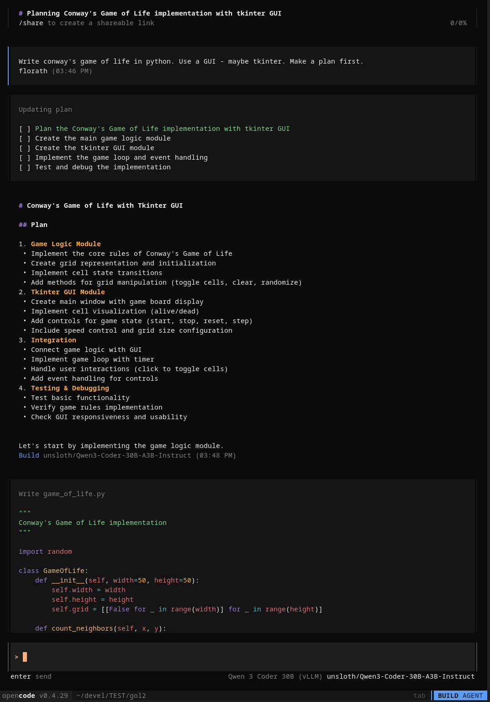

# Qwen3 Call Patch Proxy

A robust HTTP proxy server that fixes malformed tool calls from Qwen3-Coder LLM models before sending them to OpenCode or other downstream services.

## Problem Statement

Qwen3-Coder models generate tool calls with format inconsistencies that cause errors in OpenCode:
- **String parameters instead of arrays** (e.g., `todos` parameter as JSON string instead of array)  
- **String booleans instead of actual booleans** (e.g., `"True"` instead of `true`)
- **Fragmented tool calls** sent across multiple Server-Sent Events (SSE)
- **Missing required parameters** for various tools
- **Inconsistent parameter naming** (camelCase vs snake_case)

## Solution

This proxy intercepts HTTP requests between your Qwen3 model server and OpenCode, automatically:

✅ **Consolidates fragmented tool calls** across multiple SSE events  
✅ **Converts string parameters to proper types** (string→array, string→boolean)  
✅ **Generates proper tool call IDs** in OpenCode format (`call_<24_hex_chars>`)  
✅ **Adds missing required parameters** with sensible defaults  
✅ **Handles various tool types** (TodoWrite, Edit, Bash, Task, MultiEdit, etc.)  
✅ **Provides comprehensive logging** for debugging

## Demo

Here's OpenCode successfully creating Conway's Game of Life using Qwen3-Coder with the proxy:



*OpenCode planning and implementing a complete Game of Life with GUI using Qwen3-Coder model through the proxy*

## Quick Start

### Prerequisites
- Python 3.8+
- A running Qwen3-Coder model server (typically on port 8080)
- OpenCode or compatible client

### Installation

1. **Clone the repository:**
   ```bash
   git clone https://github.com/yourusername/qwen3-call-patch-proxy.git
   cd qwen3-call-patch-proxy
   ```

2. **Install dependencies:**
   ```bash
   pip install -r requirements.txt
   ```

3. **Start the proxy:**
   ```bash
   python call_patch_proxy.py
   ```

4. **Configure OpenCode to use the proxy:**
   Point OpenCode to `http://localhost:7999` instead of your model server directly.

### Architecture

```
OpenCode ──→ Proxy (port 7999) ──→ Qwen3 Server (port 8080)
                    ↓
                Fix tool calls
                    ↓
OpenCode ←── Fixed responses ←──── Qwen3 Server
```

## Supported Tools

| Tool | Fixes Applied |
|------|---------------|
| **TodoWrite** | Convert `todos` string to array |
| **Edit** | Convert `replaceAll`/`replace_all` string to boolean |
| **Bash** | Add default `description` if missing |
| **Task** | Add default `subagent_type` if missing |
| **MultiEdit** | Convert `edits` string to array |
| **Glob** | Add default `path` if missing |
| **Grep** | Validate `output_mode` enum values |

## Examples

### Before (Qwen3 Output)
```json
{
  "tool_calls": [
    {"index": 1, "function": {"arguments": "{"}},
    {"index": 2, "function": {"arguments": "\"todos\": \"[{\\\"content\\\": \\\"Test\\\", \\\"id\\\": \\\"1\\\"}]\""}},
    {"index": 3, "function": {"arguments": "}"}}
  ]
}
```

### After (Proxy Output)
```json
{
  "tool_calls": [{
    "index": 0,
    "id": "call_f9349827809c44ce8334a0d5",
    "function": {
      "name": "todowrite",
      "arguments": "{\"todos\": [{\"content\": \"Test\", \"id\": \"1\"}]}"
    }
  }]
}
```

## Configuration

The proxy uses `tool_fixes.yaml` for configuration:

```yaml
tools:
  todowrite:
    fixes:
      - name: "todos_string_to_array"
        parameter: "todos"
        condition: "is_string"
        action: "parse_json_array"
        fallback_value: []

  edit:
    fixes:
      - name: "replace_all_string_to_boolean"
        parameter: "replaceAll"
        condition: "is_string" 
        action: "convert_string_to_boolean"

settings:
  buffer_timeout: 120        # Timeout for tool call fragments
  max_buffer_size: 1048576  # Maximum buffer size (1MB)
  detailed_logging: true    # Enable debug logging
```

### Fix Actions
- `parse_json_array` - Parse JSON string into array
- `parse_json_object` - Parse JSON string into object  
- `convert_string_to_boolean` - Convert string to boolean
- `set_default` - Set default value if missing

### Fix Conditions
- `is_string` - Parameter is a string
- `missing` - Parameter is missing
- `missing_or_empty` - Parameter is missing or empty
- `invalid_enum` - Parameter not in valid values list

## Monitoring & Health Checks

- **Health check:** `GET http://localhost:7999/_health`
- **Reload config:** `POST http://localhost:7999/_reload`
- **Logs:** Check console output or redirect to file

```bash
# Run with logging
python call_patch_proxy.py > proxy.log 2>&1 &
```

Response example:
```json
{
  "status": "healthy",
  "active_requests": 2,
  "total_buffers": 5,
  "config_loaded": true,
  "target_host": "http://127.0.0.1:8080"
}
```

## Development

### Running Tests

```bash
# Test all functionality
python test_proxy.py
python test_fragment_processing.py  
python test_edit_boolean.py
python test_task_detection.py
```

### Adding New Tool Support

1. **Add tool detection** in `infer_tool_name_from_content()`:
   ```python
   elif '"your_param"' in content:
       return "your_tool_name"
   ```

2. **Add fix rules** in `tool_fixes.yaml`:
   ```yaml
   your_tool_name:
     fixes:
       - name: "your_fix_name"
         parameter: "param_name"
         condition: "is_string"
         action: "parse_json_array"
   ```

## Troubleshooting

### Common Issues

**Empty tool names:** Update tool inference function with new parameter patterns
**Fragment timeouts:** Increase `buffer_timeout` in config
**Memory usage:** Reduce `max_buffer_size` or enable more aggressive cleanup
**Connection errors:** Check that Qwen3 server is running on expected port

### Debug Mode

Enable detailed logging:
```python
LOG_LEVEL = logging.DEBUG  # In call_patch_proxy.py
```

## Contributing

1. Fork the repository
2. Create a feature branch: `git checkout -b feature/amazing-feature`
3. Make your changes and add tests
4. Commit: `git commit -m 'Add amazing feature'`
5. Push: `git push origin feature/amazing-feature`
6. Open a Pull Request

## License

This project is licensed under the GPL-3.0 License - see the [LICENSE](LICENSE) file for details.

## Acknowledgments

- Built for the OpenCode ecosystem
- Designed to work with Qwen3-Coder models from Alibaba Cloud
- Inspired by the need for robust LLM tool call handling

---

**Need help?** Open an issue or check the [discussions](../../discussions) section!